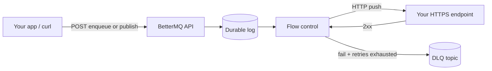

# BetterMQ

**Self-hosted HTTP message broker** — enqueue durable jobs, deliver them with signed webhook push. No workers to poll; your app receives HTTP callbacks.


[bettermq.com](https://bettermq.com) · [Interactive API docs](https://github.com/hackerrahul/BetterMQ) (`/docs` when running) · [LLM docs](https://bettermq.com/llms.txt) (full guide: `llm.txt` / `llms.txt`)

---

## What is BetterMQ?

BetterMQ is an **open-source, push-only message broker**. You send messages over HTTP; BetterMQ stores them durably and **pushes** them to your webhook URLs (like a background job queue with HTTP delivery instead of pull-based workers).

Typical uses:

- **Async jobs** — enqueue work from your API, deliver to an internal webhook handler
- **Scheduled tasks** — cron or fixed-interval jobs into a queue
- **Delayed execution** — `delay` on publish or enqueue
- **Fan-out** — one event delivered to multiple destinations (groups)
- **Rate limiting** — per-key parallelism and delivery rate (flow control)

BetterMQ is **not** a streaming log (Kafka-style) or a pull queue (SQS-style). Messages are removed after successful delivery or DLQ placement.

---

## How it works



1. **Accept** — `POST /v1/enqueue` or `POST /v1/publish` returns `202` after the message is durably stored.
2. **Snapshot** — For queues, the destination URL and secret are frozen at enqueue time (later queue updates do not affect in-flight jobs).
3. **Flow control** — Optional rate limits and per-key parallelism before delivery starts.
4. **Push** — BetterMQ sends your `body` to the destination (optional custom method, headers, HMAC signature).
5. **Retry** — Configurable retries with fixed or exponential backoff.
6. **DLQ** — After retries exhaust, a copy lands on `{queue}.__dlq` for inspection.

Delivery is **at-least-once**. Use `idempotency_key` on publish/enqueue/group publish to dedupe accepts.

---

## Features

### Messaging

- **Named queues** — register a queue name → fixed HTTPS destination URL + signing secret
- **Enqueue** — add jobs to a queue by `queue_id` (preferred) or name
- **1:1 publish** — one-off delivery to any URL without creating a queue
- **Groups (fan-out)** — one publish delivers to many member webhooks, each with its own limits
- **Batch ingest** — up to 100 messages per `POST /v1/enqueue/batch`
- **Gateway enqueue** — same body as batch; for stateless edge gateways

### Scheduling

- **Delayed jobs** — `delay` (milliseconds) on publish or enqueue
- **Cron** — 5-field UTC cron expressions (`0 9 * * *`)
- **Intervals** — `every_seconds` recurring schedules
- **Pause / resume** — per cron schedule

### Flow control

- **Flow profiles** — reusable `parallelism`, `rate`, and `period_secs`; attach via `flow_id`
- **Inline flow** — upsert limits per request without pre-creating a profile
- **Runtime admin** — pause, resume, pin, unpin, reset-rate on live lanes
- **Priority** — `0`–`9` (default `5`); with `parallelism: 1`, higher priority runs first

### Reliability

- **Retries** — per message, per queue, or broker default; fixed or exponential backoff
- **Dead letter queue (DLQ)** — `GET /v1/dlq?queue=…` after push failures
- **Idempotency keys** — safe retries from clients
- **Circuit breaker** — auto-block repeatedly failing destination hosts; manual unblock API
- **Durable storage** — local WAL or SlateDB + S3-compatible object storage (MinIO, R2)

### Delivery

- **Push-only** — no pull/worker API; your endpoint receives HTTP callbacks
- **curl-style outbound** — optional `method`, `headers`, raw `body`
- **Webhook signing** — `BetterMQ-Signature` + `BetterMQ-Timestamp` HMAC headers

### Operations

- **Embedded control panel** — `/panel/` (setup, queues, infra, docs)
- **OpenAPI 3.1 + Scalar UI** — `/docs`, `/openapi.json`
- **Health & metrics** — `/healthz`, `/readyz`, `/metrics`
- **Docker Compose** — single-node or Slate + MinIO
- **HA cluster** — multi-broker replication via panel-managed cluster (self-host)

### Self-host

- **No usage limits** — full throughput on your hardware
- **Local auth** — panel password + `sk_local_…` API token (no external account)
- **Single binary** — `bettermq serve` (Rust)

---

## Quick start

### Docker (recommended)

```bash
git clone https://github.com/hackerrahul/BetterMQ.git
cd BetterMQ/selfhost
docker compose up -d --build
open http://localhost:8080/panel/
```

1. Set a **panel password** and copy your `sk_local_…` API token.
2. Create queues and test enqueue from the panel or curl.
3. Optional: **Infrastructure** → storage (local / Slate) or **Create cluster** for HA.

See [selfhost/README.md](selfhost/README.md) for Slate + MinIO and multi-node setup.

### From source

```bash
cargo build --release -p broker-server
./target/release/bettermq serve          # default port 8080
./target/release/bettermq serve -p 9000  # custom port
```

Interactive API reference: `http://localhost:8080/docs`

---

## Authentication

| Context | Header |
|---------|--------|
| API requests | `Authorization: Bearer sk_local_…` |
| First-time setup | Panel at `/panel/` (no token yet) |

Generate or rotate the API token in **Panel → Settings** (panel password required).

Endpoints marked **Public** below do not require a Bearer token.

---

## Core concepts

| Term | Meaning |
|------|---------|
| **queue** | Named destination: `name` + HTTPS URL + HMAC secret |
| **queue_id** | Stable UUID — preferred when enqueuing |
| **publish** | One-off job to an arbitrary URL (no queue registration) |
| **enqueue** | Job on a registered queue; destination URL snapshotted at accept time |
| **flow profile** | Rate / parallelism limits; referenced by `flow_id` |
| **key** | Per-message identity; default flow-control grouping key |
| **delivery** | `{ "shard", "seq" }` — internal ack coordinates |
| **DLQ** | `{queue}.__dlq` — failed push copies |

**Retention:** primary queue records are removed after successful push or DLQ move. DLQ entries remain until you drain or export them.

---

## API endpoints

All paths are relative to your broker base URL (e.g. `http://localhost:8080`).  
Interactive reference: **`/docs`** (OpenAPI 3.1 + Scalar).

**Auth:** 🔓 no token · 🔑 `Authorization: Bearer sk_local_…`

| Method | Path | Auth |
|--------|------|------|
| GET | `/healthz`, `/readyz`, `/metrics` | 🔓 |
| GET | `/docs`, `/api-reference`, `/openapi.json` | 🔓 |
| GET | `/v1/auth/config`, `/v1/local-auth/status` | 🔓 |
| POST | `/v1/local-auth/setup`, `/v1/local-auth/regenerate` | 🔓 |
| GET | `/v1/infra/join/bootstrap` | 🔓 |
| POST | `/v1/infra/cluster/register`, `/v1/infra/cluster/test-peer` | 🔓 |
| All other `/v1/*` routes | 🔑 |

Full route index: [docs/API.md](docs/API.md).

---

## API request & response reference

### Error responses

Most failures return JSON:

```json
{ "error": "queue not found: jobs" }
```

| Status | When |
|--------|------|
| `400` | Bad request / validation |
| `404` | Queue, flow, cron, group, or lane not found |
| `503` | Replication / readiness failure |
| `500` | Internal / storage errors |

---

### `GET /healthz` · `GET /readyz` · `GET /metrics`

**`GET /healthz`** → `200`

```json
{ "status": "ok", "version": "0.2.2", "protocol": 1 }
```

**`GET /readyz`** → `200` when ready, `503` when not

```json
{ "ready": true, "cluster_healthy": true, "auth_configured": true }
```

**`GET /metrics`** → `200`

```json
{
  "blocked_hosts": 0,
  "memory_critical": false,
  "cluster_enabled": false,
  "healthy_peers": 1
}
```

---

### Local auth (first boot)

**`POST /v1/local-auth/setup`**

```json
{ "password": "your-panel-password" }
```

→ `200`

```json
{ "token": "sk_local_…", "show_once": true }
```

**`GET /v1/auth/config`** → `200`

```json
{ "mode": "local", "configured": true }
```

---

### Queues

**`POST /v1/queues`**

```json
{
  "queue": "jobs",
  "url": "https://app.example/webhooks/jobs",
  "secret": "whsec_example",
  "max_retries": 3,
  "retry_backoff": {
    "kind": "exponential",
    "initialMs": 1000,
    "maxMs": 60000,
    "multiplier": 2
  }
}
```

→ `201`

```json
{
  "queue_id": "550e8400-e29b-41d4-a716-446655440000",
  "queue": "jobs",
  "url": "https://app.example/webhooks/jobs"
}
```

**`GET /v1/queues`** → `200`

```json
{
  "queues": [
    {
      "queue_id": "550e8400-e29b-41d4-a716-446655440000",
      "queue": "jobs",
      "url": "https://app.example/webhooks/jobs"
    }
  ]
}
```

**`DELETE /v1/queues/{queue_id}`** → `200` — returns the deleted queue record (same shape as create).

---

### Publish & enqueue

Shared accept shape for **`POST /v1/publish`**, **`POST /v1/enqueue`**, and **`POST /v1/queues/{queue_id}/enqueue`**.

**`POST /v1/publish`**

```json
{
  "url": "https://app.example/hooks/one-off",
  "secret": "whsec_example",
  "key": "user-42",
  "body": { "hello": "world" },
  "priority": 8,
  "flow_id": "660e8400-e29b-41d4-a716-446655440001",
  "delay": 60000,
  "max_retries": 0,
  "idempotency_key": "job-99",
  "method": "POST",
  "headers": { "Content-Type": "application/json" },
  "sign": true
}
```

**`POST /v1/enqueue`**

```json
{
  "queue_id": "550e8400-e29b-41d4-a716-446655440000",
  "key": "user-42",
  "body": { "task": "send_invoice", "invoice_id": 99 },
  "priority": 8,
  "flow_id": "660e8400-e29b-41d4-a716-446655440001",
  "delay": 60000,
  "idempotency_key": "inv-99",
  "sign": true
}
```

`body` accepts a JSON value or a string. Either `queue_id` or `queue` name is required for enqueue.

**Immediate accept** → `202`

```json
{
  "message_id": "7c9e6679-7425-40de-944b-e07fc1f90ae7",
  "queue": "jobs",
  "duplicate": false,
  "delivery": { "shard": 0, "seq": 12 }
}
```

**Idempotent duplicate** → `200` (same body, `"duplicate": true`)

**Delayed** (`delay` set) → `202` — no `message_id` or `delivery`; `scheduled` is present:

```json
{
  "queue": "jobs",
  "duplicate": false,
  "scheduled": {
    "schedule_id": "8f14e45f-ceea-467f-a0fe-7a3abb2af606",
    "deliver_at_ms": 1717189260000
  }
}
```

For publish, `queue` is the internal topic `__direct`. Omitted JSON fields are not sent when empty (`message_id`, `delivery`, `scheduled`).

---

### Batch enqueue

**`POST /v1/enqueue/batch`** and **`POST /v1/gateway/enqueue`** use the **wire format** (`PublishRequest`), not the friendly enqueue field names:

```json
{
  "messages": [
    {
      "topic": "jobs",
      "routing_key": "user-42",
      "payload": { "task": "a" },
      "queue_id": "550e8400-e29b-41d4-a716-446655440000",
      "delay_ms": 5000,
      "priority": 5,
      "idempotency_key": "batch-1"
    }
  ]
}
```

→ `202`

```json
{
  "accepted": 1,
  "message_ids": ["7c9e6679-7425-40de-944b-e07fc1f90ae7"]
}
```

Self-host: no batch size cap. Cloud builds cap at 100 messages per request.

---

### Groups (fan-out)

**`POST /v1/groups`** `{ "name": "billing-alerts" }` → `201`

```json
{
  "group_id": "a1b2c3d4-e5f6-7890-abcd-ef1234567890",
  "name": "billing-alerts",
  "paused": false
}
```

**`POST /v1/groups/{group_id}/members`**

```json
{
  "name": "primary",
  "url": "https://app.example/hooks/a",
  "secret": "whsec_example",
  "parallelism": 1,
  "rate": 50,
  "period_secs": 60,
  "flow_key": "user-42"
}
```

→ `201` — `MemberResponse` with `member_id`, `group_id`, `name`, `url`, `paused`, `parallelism`, `rate`, `period_secs`, optional `flow_key`.

**`POST /v1/groups/{group_id}/publish`**

```json
{
  "key": "user-42",
  "body": { "event": "invoice.paid" },
  "idempotency_key": "inv-99"
}
```

→ `202`

```json
{
  "group_id": "a1b2c3d4-e5f6-7890-abcd-ef1234567890",
  "accepted": 2,
  "deliveries": [
    {
      "member_id": "b2c3d4e5-f6a7-8901-bcde-f12345678901",
      "message_id": "7c9e6679-7425-40de-944b-e07fc1f90ae7",
      "duplicate": false,
      "shard": 0,
      "seq": 4
    }
  ]
}
```

**`GET /v1/groups/{group_id}`** → `200`

```json
{
  "group": { "group_id": "…", "name": "…", "paused": false },
  "members": [ { "member_id": "…", "group_id": "…", "name": "…", "url": "…", "paused": false, "parallelism": 1, "rate": 50, "period_secs": 60 } ]
}
```

---

### Flow profiles & runtime

**`POST /v1/flows`**

```json
{ "key": "user-42", "parallelism": 2, "rate": 100, "period_secs": 60 }
```

→ `201`

```json
{
  "flow_id": "660e8400-e29b-41d4-a716-446655440001",
  "key": "user-42",
  "parallelism": 2,
  "rate": 100,
  "period_secs": 60
}
```

**`GET /v1/flow/{key}?queue_id=…`** → `200`

```json
{
  "flow_key": "user-42",
  "endpoint_id": "550e8400-e29b-41d4-a716-446655440000",
  "wait_list_size": 3,
  "parallelism_max": 2,
  "parallelism_count": 1,
  "rate_max": 100,
  "rate_count": 12,
  "rate_period_secs": 60,
  "rate_period_start_ms": 1717189200000,
  "paused": false,
  "pinned_parallelism": false,
  "pinned_rate": false
}
```

**`PUT /v1/flow/{key}?queue_id=…`** — body: `{ "parallelism", "rate", "period_secs" }` → `200` (`FlowProfileResponse`).

**`POST /v1/flow/{key}/pause|resume|reset-rate`** → `204` (no body).

**`POST /v1/flow/{key}/pin`** — `{ "parallelism": 1, "rate": 10, "period_secs": 60 }` → `204`.

**`GET /v1/flow/global`** → `200` — `{ "parallelism_max": null, "parallelism_count": 4 }`.

Query `queue_id`, `flow_id`, or `group_member_id` to select the lane owner.

---

### Cron & delayed

**`POST /v1/crons`** — provide **`cron`** or **`every_seconds`**, not both. Target via `queue` / `queue_id` or direct `url` + `secret`:

```json
{
  "cron": "0 9 * * *",
  "queue": "jobs",
  "key": "daily-report",
  "body": { "report": true },
  "flow_id": "660e8400-e29b-41d4-a716-446655440001"
}
```

→ `201`

```json
{
  "cron_id": "c1d2e3f4-a5b6-7890-cdef-123456789abc",
  "schedule_type": "cron",
  "cron": "0 9 * * *",
  "queue": "jobs",
  "paused": false,
  "next_run_at_ms": 1717225200000,
  "created_at_ms": 1717189200000,
  "last_run_at_ms": null
}
```

Interval schedules use `"schedule_type": "interval"` and `"every_seconds": 30` (no `cron` field).

**`POST /v1/crons/{cron_id}/pause`** / **`resume`** → `200` (`CronResponse`).

**`GET /v1/delayed`** → `200`

```json
{
  "delayed": [
    {
      "schedule_id": "8f14e45f-ceea-467f-a0fe-7a3abb2af606",
      "queue": "jobs",
      "key": "user-42",
      "deliver_at_ms": 1717189260000,
      "body": "{\"task\":\"later\"}"
    }
  ]
}
```

**`DELETE /v1/delayed/{schedule_id}`** → `200` — returns the cancelled job (same shape as list item).

---

### DLQ

**`GET /v1/dlq?queue=jobs&limit=10`** → `200` (default `limit` = 10)

```json
{
  "queue": "jobs",
  "dlq_topic": "jobs.__dlq",
  "messages": [
    {
      "message_id": "7c9e6679-7425-40de-944b-e07fc1f90ae7",
      "key": "user-42",
      "body": "{\"task\":\"failed\"}",
      "published_at_ms": 1717189200000
    }
  ]
}
```

---

### Ops & cluster

**`GET /v1/destinations/blocked`** → `200`

```json
{
  "hosts": [
    { "host": "https://api.example.com:443", "remaining_ms": 45000 }
  ]
}
```

**`POST /v1/destinations/unblock`** `{ "host": "https://api.example.com:443" }` → `200` (empty body).

**`GET /v1/cluster`** → `200` — `enabled`, `cluster_id`, `node_count`, `healthy_count`, `scheduler_leader_id`, `nodes[]`, `shards[]` (see `/docs` for full schema).

---

## Example: enqueue a job

```bash
export TOKEN="sk_local_…"

# 1. Create queue → 201
curl -sS -X POST http://localhost:8080/v1/queues \
  -H "Authorization: Bearer $TOKEN" \
  -H "Content-Type: application/json" \
  -d '{
    "queue": "jobs",
    "url": "https://app.example/webhooks/jobs",
    "secret": "whsec_example"
  }'
# → {"queue_id":"550e8400-…","queue":"jobs","url":"https://app.example/webhooks/jobs"}

# 2. Enqueue → 202
curl -sS -X POST http://localhost:8080/v1/enqueue \
  -H "Authorization: Bearer $TOKEN" \
  -H "Content-Type: application/json" \
  -d '{
    "queue": "jobs",
    "key": "user-42",
    "body": { "task": "send_invoice", "invoice_id": 99 },
    "priority": 8,
    "sign": true
  }'
# → {"message_id":"7c9e6679-…","queue":"jobs","duplicate":false,"delivery":{"shard":0,"seq":12}}
```

BetterMQ POSTs `{ "task": "send_invoice", "invoice_id": 99 }` to your webhook URL (plus `BetterMQ-Signature` headers when `sign: true`).

---

## Retry policy

Resolution order: **request** → **queue defaults** → **`dispatch.retry` in `bettermq.json`**.

```json
{
  "max_retries": 5,
  "retry_backoff": {
    "kind": "exponential",
    "initialMs": 1000,
    "maxMs": 60000,
    "multiplier": 2
  }
}
```

`max_retries` is additional attempts after the first failure (`0` = one try total).

---

## Repository layout

| Path | Purpose |
|------|---------|
| [`engine/`](engine/) | Rust workspace — `bettermq` server binary and crates |
| [`selfhost/`](selfhost/) | Docker Compose, self-host deployment |
| [`docs/`](docs/) | Architecture, API details, operations |

Deeper API examples and architecture notes: [docs/API.md](docs/API.md), [docs/ARCHITECTURE.md](docs/ARCHITECTURE.md).

---

## Control panel

| URL | Purpose |
|-----|---------|
| `/panel/` | Web UI — setup, queues, flows, crons, DLQ, infrastructure |
| `/docs` | Embedded OpenAPI reference |

---

## License

Dual-licensed under [MIT](LICENSE-MIT) or [Apache-2.0](LICENSE-APACHE), at your option.
